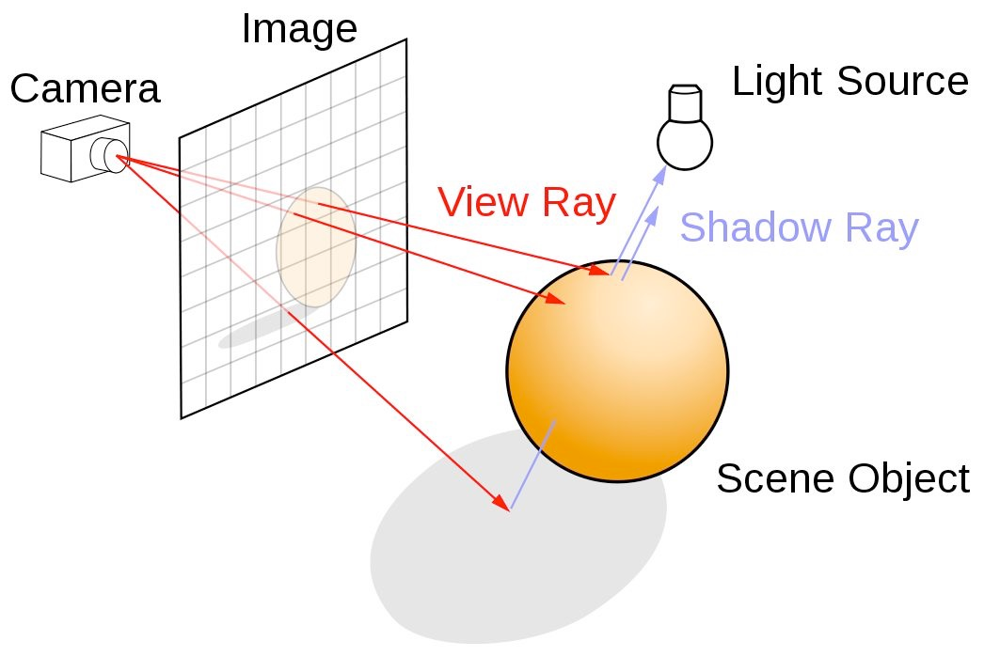

## &#x1F386; a ray tracer written in rust &#x1F386;

### Usage
Clone this (`msyvr/ruray`) repo, then:
```bash
cargo run -- image-file-name-no-format
```

## Project objective
Build a basic ray tracing engine to exercise my new Rust skills.

#### Goal 0
Write a slice of directly-computed pixels to an image format. No scene, just set up the render capability.
```rust
let r = (0.1 + ((col as f32) * 0.9 / (display.0 as f32 - 1.0))) as f32;
let g = 0.5;
let b = (0.1 + ((row as f32) * 0.9 / (display.1 as f32 - 1.0))) as f32;
```


#### Goal 1
Generate a photo-realistic image of a configured scene. 
- Start by defining a `world` which includes both a `scene` (with lighting) and a `display` and a 'camera' `viewpoint`. 
- Trace a `ray` that emanates from the `viewpoint`, passes through a `display` `pixel`, and interacts with the `scene`.
  - Each interaction contributes to the final color value of that display `pixel`. 
- Repeat for all `display` pixels. 
- Save the display's pixel values (rgb tuples) to a (formatted) image file.

From an [Nvidia ray tracing post](https://developer.nvidia.com/discover/ray-tracing), an overview of the conceptual layout of the 'world':


#### Goal 2
Optimize the code for speed.
- Probably by implementing [Rayon](https://docs.rs/rayon/latest/rayon/).
- Look into GPU acceleration (stretch).

#### Goal 3 (stretch)
Create an animation.
- Optimized code essential to be able to step through multiple real-time renders 'live'. 
- Consider running on a cloud provider's more powerful machine (with GPU acceleration).

### LICENSE
Not having looked into licenses for a while, I did a quick search and found [this](https://www.reddit.com/r/opensource/comments/1b5oeq4/comment/kta5hwv/), which seemed to align with my intent - so Apache 2.0 it is. See the [LICENSE](https://github.com/msyvr/ruray?tab=License-1-ov-file) for details.
